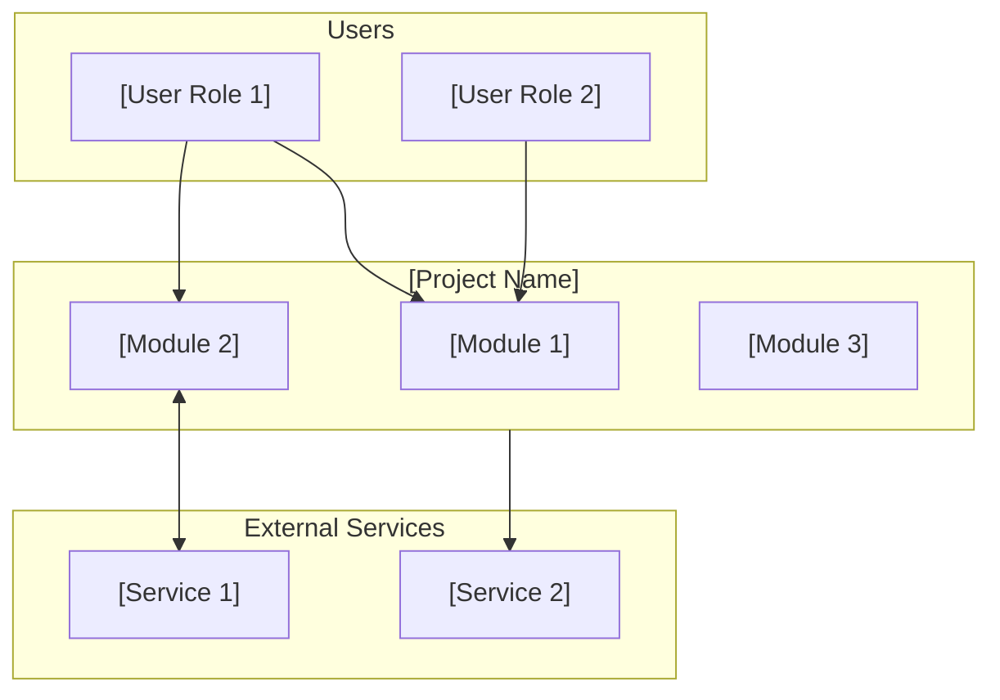
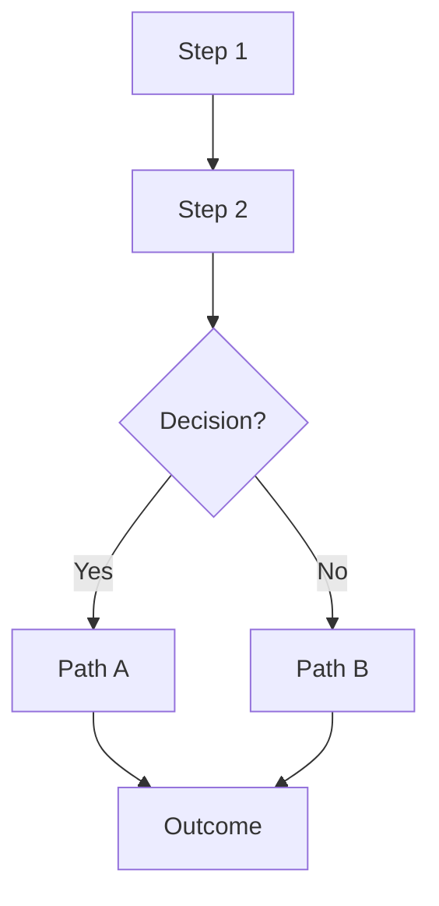
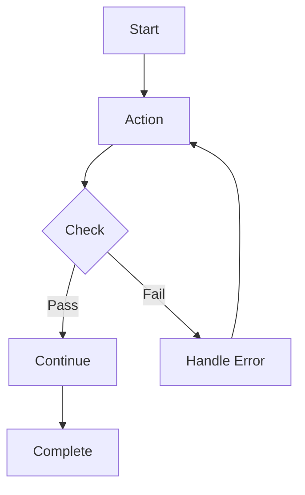
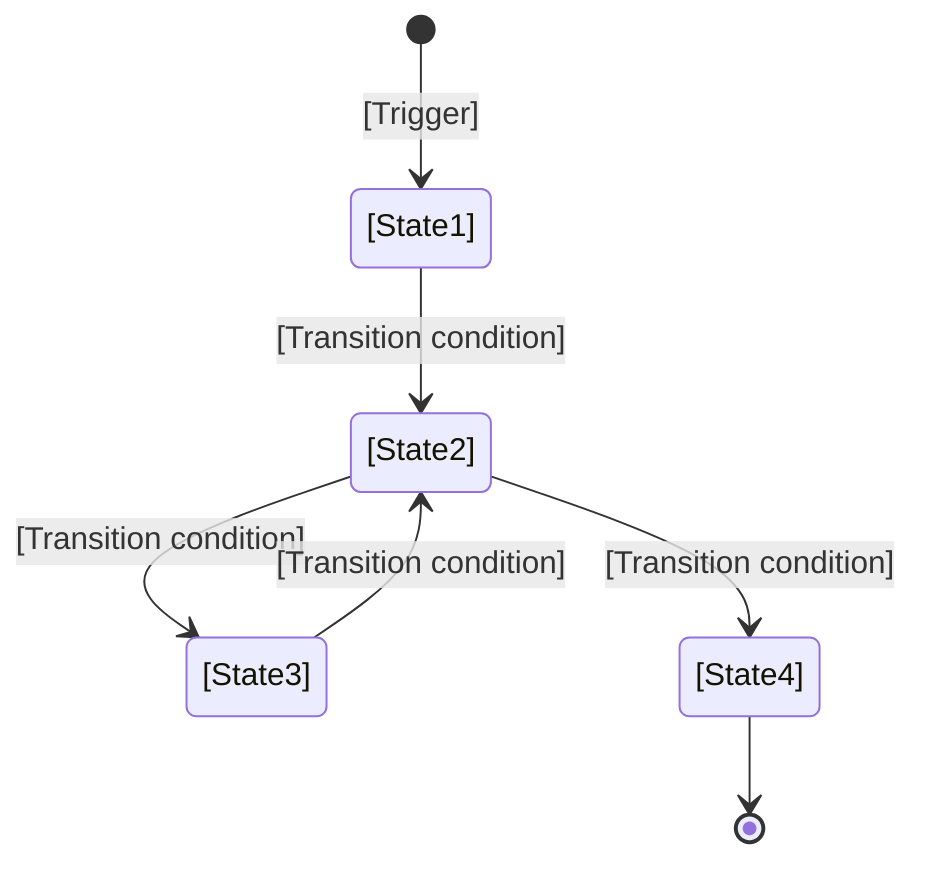
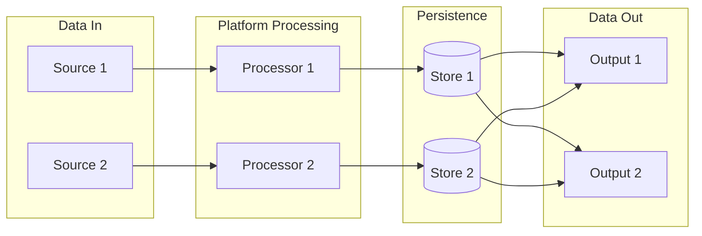
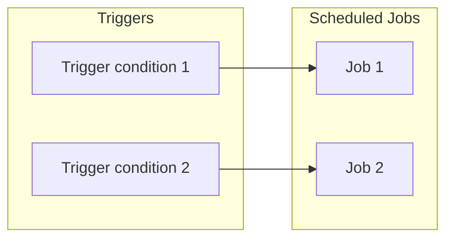
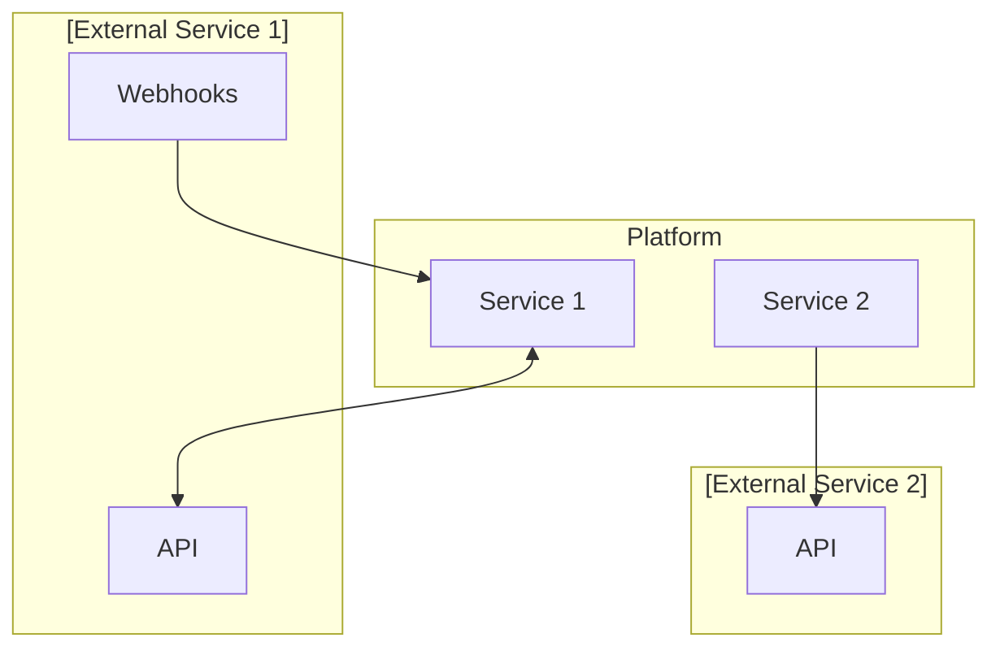

# [Project Name] — Business Process Flows

## Document Purpose

This document describes the key business processes and user workflows for [Project Name]. Each flow includes a Mermaid diagram for visual reference and prose description of the business logic.

---

## 1. Platform Overview

### 1.1 User Roles

| Role | Description | Primary Activities |
|------|-------------|-------------------|
| **[Role 1]** | [Description] | [Activities] |
| **[Role 2]** | [Description] | [Activities] |
| **[Role 3]** | [Description] | [Activities] |

---

### 1.2 High-Level System Context

[Describe how the system modules interact with users and external services.]

---

## 2. [Process Name 1]

### 2.1 [Flow Name]

**Process Description:**

1. **[Step 1]:** [Description of what happens]
2. **[Step 2]:** [Description of what happens]
3. **[Decision]:** [Description of the branching logic]

---

## 3. [Process Name 2]

### 3.1 [Flow Name]

**Process Description:**

1. **[Step 1]:** [Description]
2. **[Step 2]:** [Description]

---

## 4. [Entity] Status State Machine

---

## 5. Data Flow Summary

---

## 6. Scheduled Jobs

---

## 7. External Service Integration

