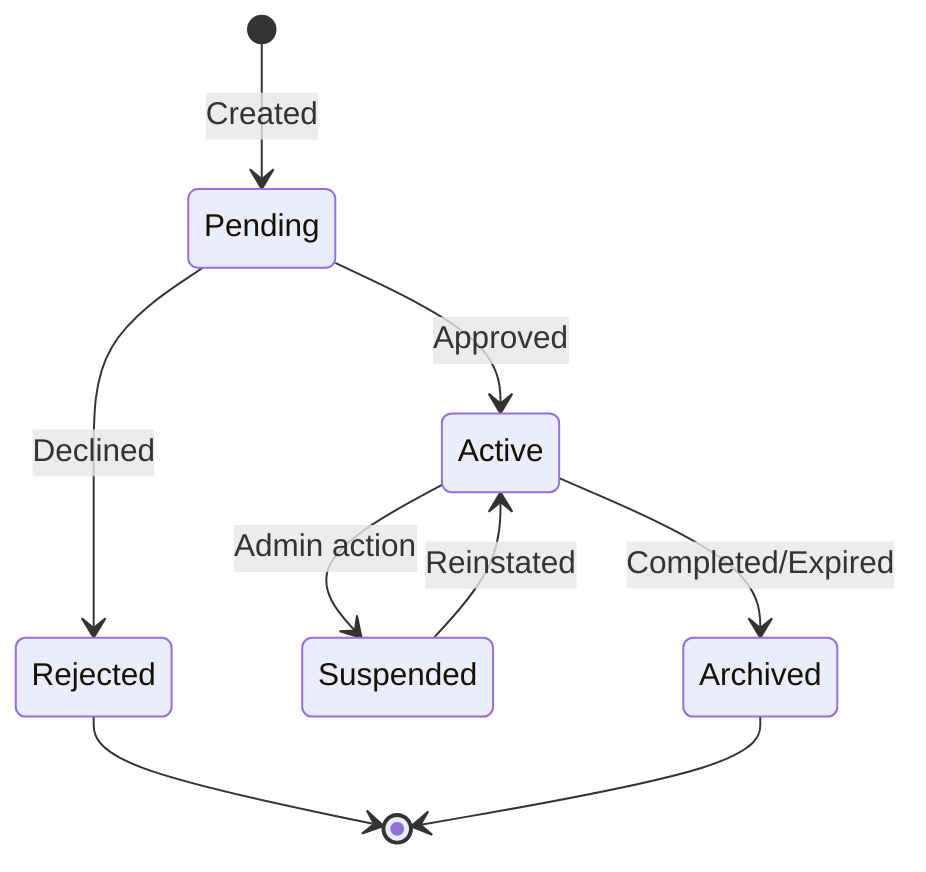
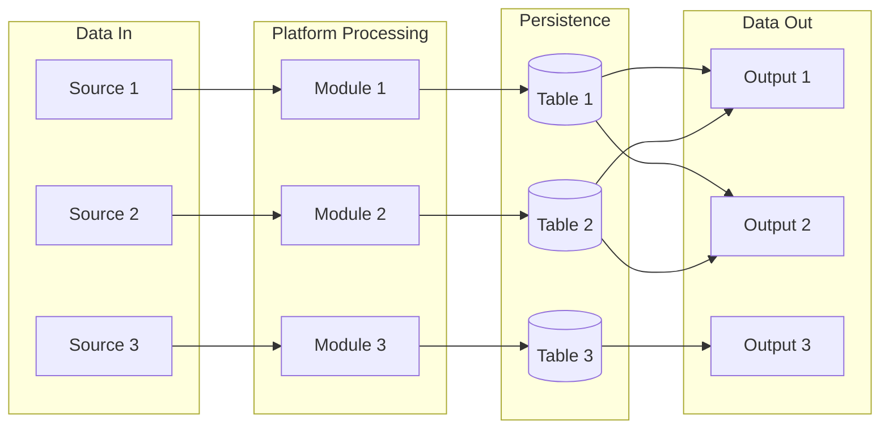

# [Project Name] — System Process Diagram

## Complete System Overview

```mermaid
flowchart TB
    subgraph ENTRY["ENTRY POINTS"]
        V1[/"[User Type 1]"/]
        V2[/"[User Type 2]"/]
    end

    subgraph ONBOARD["ONBOARDING"]
        O1[Create Account]
        O2[Verify Email]
        O3[Configure Settings]
        O4{Setup Complete?}
        O5[Active]
        O6[Pending Setup]
    end

    subgraph CORE["CORE WORKFLOW"]
        C1{Entry Method}
        C2[Path A]
        C3[Path B]
        C4{Validation?}
        C5[Process]
        C6[Reject]
        C7[Generate Output]
    end

    subgraph STATUS["ENTITY LIFECYCLE"]
        S1((Pending))
        S2((Active))
        S3((Suspended))
        S4((Archived))
    end

    subgraph PROCESSING["DATA PROCESSING"]
        P1[Input Received]
        P2[Validate]
        P3{Valid?}
        P4[Process]
        P5[Error Handling]
        P6[Store Result]
        P7[Notify User]
    end

    subgraph EXTERNAL["EXTERNAL SERVICES"]
        EX1[([Service 1])]
        EX2[([Service 2])]
        EX3[([Service 3])]
    end

    %% Entry flows
    V1 --> O1
    V2 --> C1

    %% Onboarding flow
    O1 --> O2 --> O3 --> O4
    O4 -->|Yes| O5
    O4 -->|No| O6 --> O3

    %% Core workflow
    O5 --> C1
    C1 -->|Path A| C2 --> C4
    C1 -->|Path B| C3 --> C4
    C4 -->|Yes| C5 --> C7
    C4 -->|No| C6

    %% Processing flow
    C7 --> P1 --> P2 --> P3
    P3 -->|Yes| P4 --> P6 --> P7
    P3 -->|No| P5 --> P7

    %% Status transitions
    S1 -->|Approved| S2
    S2 -->|Suspended| S3
    S3 -->|Reinstated| S2
    S2 -->|Archived| S4

    %% External connections
    P4 -.-> EX1
    P7 -.-> EX2
    P6 -.-> EX3

    %% Styling
    classDef entry fill:#e1f5fe,stroke:#01579b
    classDef process fill:#fff3e0,stroke:#e65100
    classDef decision fill:#fce4ec,stroke:#880e4f
    classDef status fill:#e8f5e9,stroke:#2e7d32
    classDef external fill:#f3e5f5,stroke:#7b1fa2

    class V1,V2 entry
    class S1,S2,S3,S4 status
    class EX1,EX2,EX3 external
```

---

## Process Legend

| Colour | Meaning |
|--------|---------|
| Blue (light) | Entry points |
| Orange | Core processes |
| Pink | Decision points |
| Green | Entity statuses |
| Purple | External services |

---

## Key Process Chains

### 1. [Process Chain 1]

```
[Step 1] -> [Step 2] -> [Step 3] -> [Step 4] -> [Outcome]
```

### 2. [Process Chain 2]

```
[Step 1] -> [Step 2] -> [Decision] -> [Step 3a/3b] -> [Outcome]
```

### 3. [Process Chain 3]

```
[Step 1] -> [Step 2] -> [Step 3] -> [Step 4] -> [Outcome]
```

---

## [Entity] Status State Machine



---

## Data Flow Summary


